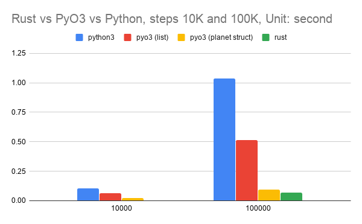
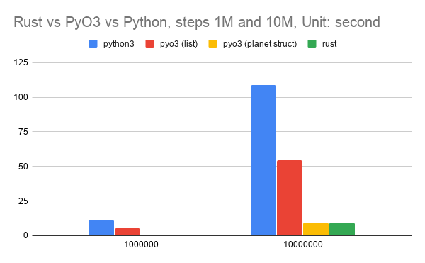

Performance Comparison: Rust vs PyO3 vs Python
----------------------------------------------

I am using `n-body <https://benchmarksgame-team.pages.debian.net/benchmarksgame/description/nbody.html#nbody>`_ to compare the performance among Rust, PyO3 and Python.

This repo includes three parts of code:

- :code:`rnbody` is Rust version, source code from `benchmarksgame Rust <https://benchmarksgame-team.pages.debian.net/benchmarksgame/program/nbody-rust-1.html>`_ .
- :code:`rnbody_pyo3` is python using pyo3 version, the main function :code:`advance` is using rust code to calculate.
- :code:`pnbody.py` is python version, source code from `benchmarksgame Python <https://benchmarksgame-team.pages.debian.net/benchmarksgame/program/nbody-python3-1.html>`_ with slightly update on :code:`BODIES` data type.

How to Use
^^^^^^^^^^

- :code:`rnbody`: Make sure installed :code:`rust` and :code:`cargo`. And then run :code:`cargo run 10000` in :code:`rbody` folder.  (:code:`10000` is steps which used in calculating nbody)
- :code:`rnbody_pyo3`:
  - Install rust nightly. Currently :code:`master` branch of PyO3 is able to use stable rust version. But I am using :code:`0.10.1` of `pyo3 <https://github.com/PyO3/PyO3>`_ (Reuqired Python3).
  - Install `setuptools-rust <https://github.com/PyO3/setuptools-rust>`_ .
  - In folder :code:`rnbody_pyo3` run :code:`python setup.py develop`.
  - Run :code:`./pnbody_pyo3 10000` (using :code:`Planet` struct to representing planet data) or :code:`./pnbody_pyo3 10000 --list` (using :code:`vec` to representing planet data)
- :code:`pnbody.py`: Run :code:`./pnbody.py 10000`.

Performance
^^^^^^^^^^^

Testing setup:

- PC: ThinkPad T490
- CPU: intel i7 8th Gen
- OS: Ubuntu 16.04
- Python version: 3.7.6
- rustc version: 1.46.0-nightly (:code:`ff5b446d2` 2020-06-23)
- cargo version: 1.46.0-nightly (:code:`089cbb80b` 2020-06-15)
- PyO3 version: 0.10.1
- :code:`setuptools-rust`: 0.10.6

Run following commands 100 times each with different steps value.

(Used steps: 10K, 100K, 1M, 10M)

- Python :code:`./pnbody.py <steps>`
- PyO3 with :code:`list` struct :code:`./pnbody_pyo3 <steps> --list` in :code:`rnbody_pyo3` folder.
- PyO3 with rust :code:`Planet` struct :code:`./pnbody_pyo3 <steps>` in :code:`rnbody_pyo3` folder.
- Rust :code:`cargo run <steps>` in :code:`rnbody` folder.

Performance chart:

Split chart into two charts since 10K and 10M have quite large gap.

